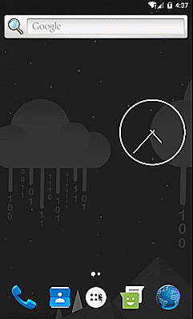

# NativeScript-Calendar-WeekView :calendar:
NativeScript Calendar Week View provides week view and day view.It allow creating events and viewing them in week view.The plugin is highly under construction so any feedbacks and PRs are most Welcome.

### Under Construction

- [x] Plugin Setup
- [x] WeekView with Properties Enabled
- [x] Adding of Event 
- [ ] Delete Event 
- [ ] Async Event
- [ ] Gesture Events

## Demo Run



#### Native Libraries: 
Android | 
---------- | 
[alamkanak/Android-Week-View](https://github.com/alamkanak/Android-Week-View) 

## Installation
From your command prompt/termial go to your app's root folder and execute:

`tns plugin add nativescript-calendar-weekview`

## Usage
#### XML:
```XML
<Page  xmlns="http://schemas.nativescript.org/tns.xsd" 
    xmlns:CalendarWeekView="nativescript-calendar-weekview" loaded="pageLoaded" class="page">
    <ActionBar title="NativeScript-Calendar-WeekView" />
    <ScrollView>
         <StackLayout>
   <CalendarWeekView:CalendarWeekView headerColumnBackground="#ffffff" todayBackgroundColor="#1848adff" noOfVisibleDays="3"  dayBackgroundColor="#05000000" headerRowBackgroundColor="#ffefefef" columnGap="30" headerColumnTextColor="#8f000000" headerRowPadding="30" headerColumnPadding="30" hourHeight="120" textSize="30" />
    </StackLayout>
    </ScrollView>
</Page>
```

### TS:
```TS

import {CalendarWeekView} from 'nativescript-calendar-weekview';
public CalendarWeekView: CalendarWeekView;

```

## Angular + Typescript:
```javascript
import {Component, ElementRef, ViewChild} from '@angular/core';
import {registerElement} from "nativescript-angular/element-registry";

registerElement("CalendarWeekView", () => require("nativescript-calendar-weekview").CalendarWeekView);

@Component({
    selector: 'calendar-weekview-example',
    template: `
        <ActionBar title="Nativescript-Calendar-WeekView"  style="background-color:#ED2831; color:white">
        <ActionItem  (tap)="addEvent()">
        <Label class="actionItemLabel" text="Add" color="white" ></Label>
        </ActionItem>
        </ActionBar>
        <StackLayout>
        <CalendarWeekView #CalendarWeekView  headerColumnBackground="#ffffff" todayBackgroundColor="#1848adff" noOfVisibleDays="3"  dayBackgroundColor="#05000000" headerRowBackgroundColor="#ffefefef" columnGap="30" headerColumnTextColor="#8f000000" headerRowPadding="30" headerColumnPadding="30" hourHeight="120" textSize="30" >
    </CalendarWeekView>
        </StackLayout>
    
    `
})
export class CalendarViewExample {

     @ViewChild("CalendarWeekView") CalendarWeekView: ElementRef;

      addEvent() {
        let event = this.CalendarWeekView.nativeElement;
        // provide params in this order
        // addEvent(id,name,startYear, startMonth, startDay,startHour,startMinute,endYear,endMonth, endDay, endHour,endMinute,eventColor)
        event.addEvent(1, "first Event", 2017, 3, 14, 3, 3, 2017, 3, 14, 7, 5, "#87d288");
        event.addEvent(2, "Second Event", 2017, 3, 15, 5, 3, 2017, 3, 15, 7, 5, "#59DBE0");
        event.addEvent(3, "Third Event", 2017, 3, 14, 8, 3, 2017, 3, 14, 10, 5, "#F66C4E");

    }
    }

}
```


## Attributes
**textSize - (int)** - *optional*

Attribute to specify the size of text in weekview.

**hourHeight - (int)** - *optional*

Attribute to specify the size of text in weekview.

**headerColumnPadding - (int)** - *optional*

Attribute to specify the padding between header columns in weekview.

**headerRowPadding - (int)** - *optional*

Attribute to specify the padding between header rows in weekview.

**headerColumnTextColor - (color string)** - *optional*

Attribute to specify the text color of column headers in weekview.

**columnGap - (int)** - *optional*

Attribute to specify the gap between columns in weekview.

**headerRowBackgroundColor - (color string)** - *optional*

Attribute to specify the background color of header rows in weekview.

**dayBackgroundColor - (color string)** - *optional*

Attribute to specify the color of day i.e. not today in weekview.
 
**noOfVisibleDays - (int)** - *optional*

Attribute to specify the visibility of days (i.e.1,3,7 days) in weekview.

**todayBackgroundColor - (color string)** - *optional*

Attribute to specify the color of today bacground in weekview.

**headerColumnBackground - (color string)** - *optional*

Attribute to specify the background color of column headers in weekview.

## Methods

**addEvent()** - Add Event with necessary Parameters passed and rendered in calendar*

